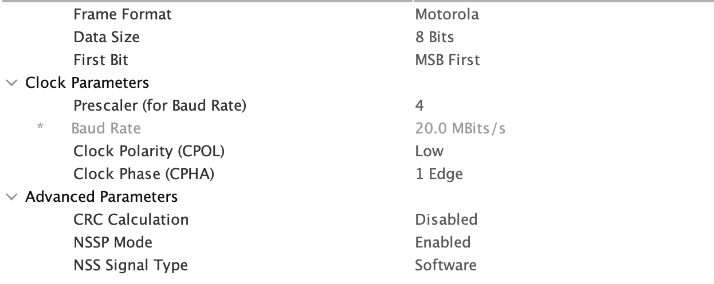

# LoRaSTM32 (not finished)
## Usage

Setup spi on cubeMX, maximum rate about 20MBps:


---
After copying the library folder inside your preferred directory, import the header file:

```
#include "[Path]/LoRa.h"
```
---
## loRaInit
`int loRaInit(SPI_HandleTypeDef *hspi, GPIO_TypeDef *NSS_GPIOx, uint16_t NSS_GPIO_Pin, GPIO_TypeDef *RESET_GPIOx, uint16_t RESET_GPIO_Pin, GPIO_TypeDef *DIO0_GPIOx, uint16_t DIO0_GPIO_Pin)`
	     
Initialize the loRa module before start of operations, the method receives all the spi pin and ports.
Default values: 
- Frequency: 868.0 MHz
- BW: 125MHz
- Power: 15dbm
  
Example of usage:
```
if (loRaInit(&hspi3, SPI_3_CS0_GPIO_Port, SPI_3_CS0_Pin, DIO0_INT_GPIO_Port, DIO0_INT_Pin, LoRa_RST_GPIO_Port, LoRa_RST_Pin)){
	//Initialization was successful, add custom parameters
}else{
	//Failed init, example of response (loops while lora not initializing)
	do{
		HAL_Delay(1000);
	}while(!loRaInit(&hspi3, SPI_3_CS0_GPIO_Port, SPI_3_CS0_Pin, DIO0_INT_GPIO_Port, DIO0_INT_Pin, LoRa_RST_GPIO_Port, LoRa_RST_Pin));
}
```

---
## Send a packet
- Asynchronous mode: interrupt handling

`int loRaSendPacket(bool explicitHeader, const uint8_t *buffer, size_t size);`

The packet will be sent and the main process can continue with the normal flux of operations.
End of operations has to be handled via DIO0 interrupt handler callback, after the callback is received the user has to call the interrupt handler method:
### DI0 Interrupt handler

This method authomatically unerstands the reason of the interrupt trigger, subsequentially calling the specific callback method provided by the user:

`void loRaDIO0InterruptHandler(void (*TXcallback)(void), void (*RXcallback)(void), void (*CADCallback)(int), void (*CRCErrorCallback)(void));`

During trasmission the user knows that the interrupt is triggered by an end of trasmission, so only the TXCallback can be provided.

Example:

```
void loRaTXCallback(){
	//stuff to do when tx done, like another tx, or wait some time  then another tx!
	HAL_Delay(1000);
	loRaSendPacket(FALSE, buff, sizeof(buff));
}

void HAL_GPIO_EXTI_Callback(uint16_t GPIO_Pin){
	if(GPIO_Pin == DIO0_INT_Pin){
		loRaDIO0InterruptHandler(loRaTXCallback, NULL, NULL, NULL);
	}

}
```

- Polling mode: 
